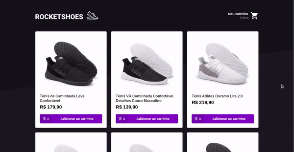

<h1 align="center">
    
     
     
    Rocketshoes
</h1>

  Um projeto Front-end e Mobile de um e-commerce de venda de calçados.

  
  

## :scroll: Sobre

O repositório conta com um projeto frontend e um mobile para consumir uma API-REST fake e simular uma loja virtual de venda de calçados.

Tanto a versão mobile e frontend conta uma tela listagem de produtos para adicionar no carrinho e uma tela para exibir mais detalhes dos produtos escolhidos e do carrinho.

O objetivo final deste projeto era botar em prática todo o conhecimento sobre Redux e Redux Saga passado no bootcamp da @rocketseat.

### :rocket: Iniciando 
1. `git clone git@github.com:GustavoBlaze/rocketshoes.git`
2. `cd rocketshoes`

### 💻 Iniciando com o Front-end 
1. `cd frontend`
2. `yarn`
3. `yarn add json-server -D`
4. `json-server server.json -p 3333 -w -d 300`
5. `yarn start`

### 📱Iniciando com o Mobile 
1. `cd mobile`
2. `yarn`
3. `json-server server.json -p 3333 -w -d 300`
4. `react-native start`
5. `react-native run-android` ou `react-native run-ios`

### 🧰 Ferramentas utilizadas
- ⚛️ **ReactJs** - Biblioteca Javascript para criar interfaces de usuário.
- ⚛️ **React Native** - Framework para criar apps nativos usando React.
- 💅 **Styled Components** - Biblioteca Javascript pra estilizar componentes.
- 🔁 **Redux** - Biblioteca JavaScript de código aberto para gerenciar o estado do aplicativo.
- 🔂  **Redux Saga** - Biblioteca Javascript que torna os efeitos colaterais do aplicativo mais faceis de gerenciar.
